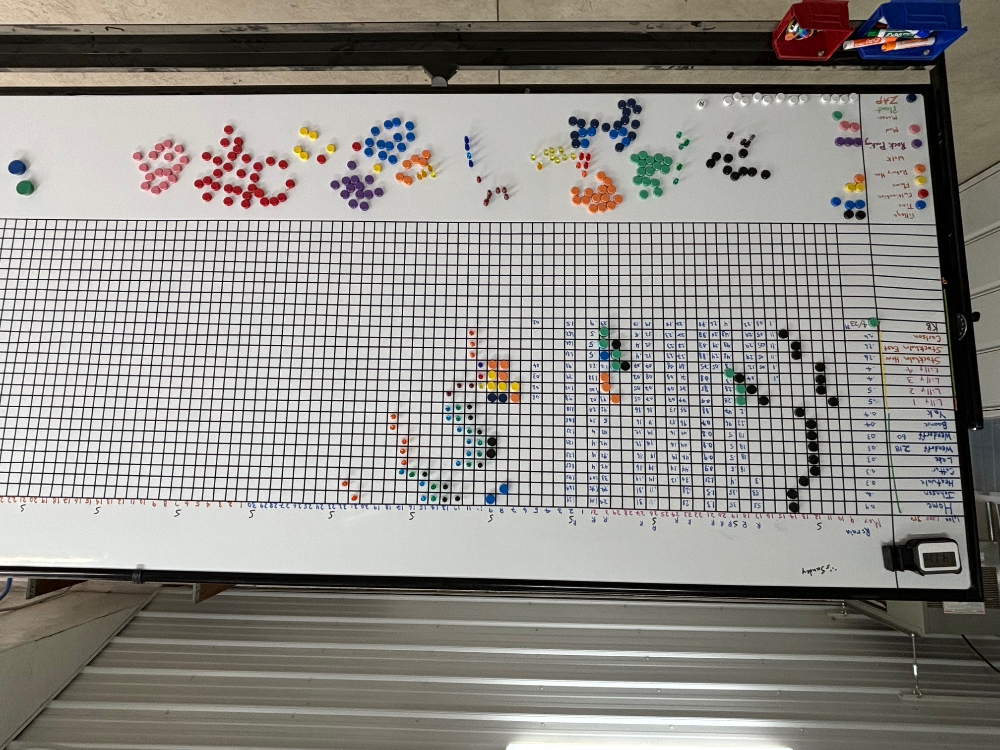

## About
Farm Flow is a system for team management and crop planning developed by Matthew
Fitzgerald and [Fitzgerald Organics](https://fitzgeraldorganics.net). Originally
designed as a physical whiteboard, the Farm Flow app is a digital adaptation of
the Farm Flow system, built in collaboration with [Runrig](https://runrig.org).
The primary aim is to bring the benefits of this methodology to more farms and
to put realtime data and visualizations at the fingertips of every member of the
team.



## Get Involved
If you're interested in using Farm Flow or have questions about its development,
feel free to open up a new topic in the [Runrig
Discussions](https://github.com/orgs/runrig-coop/discussions/) forum. You can
also view the [roadmap](https://github.com/orgs/runrig-coop/projects/3) and
[kanban](https://github.com/orgs/runrig-coop/projects/3/views/3) we're using for
collective project management. More documentation on how to use Farm Flow will
be forthcoming as we prepare to launch the first pilot. So stay tuned!

For now, a demo is available at https://farm-flow-board.pages.dev. You will need
to import a data file to get started, which can be downloaded as JSON from the
project's GitHub repository:
[`crop-2023.json`](https://github.com/runrig-coop/farm-flow-board/blob/main/public/crop-2023.json).
This demo should considered experimental and highly unstable; it will not be
provided with ongoing support.

See [CONTRIBUTING.md](CONTRIBUTING.md) for full instructions on how to setup the
local development environment.

## Architecture & Design
### Runrig Design Principles
The Farm Flow board has been developed in accordance to several of Runrig's
design principles, most notably:

- Identify the __core competency__ of the application that will most immediately
  add value to the user's existing workflow, without reproducing functionality
  that already exists in other applications.
- Adapt the application to function as a __middleware__ or "glue service" that
  can augment existing FOSS applications and services, while still remaining
  relatively independent and agnostic of the host application's service
  architecture.
- Maintain __data independence__ and separate the domain model from the service
  architecture as much as possible. Ensure that __data portability__ is a
  first-order feature from the very first iteration.

### TypeScript, Vue.js, and HTML Canvas
The application uses TypeScript for its versatility in browser, server, and
desktop environments. This first pilot is implemented as a single-page
application (SPA) that can be deployed to any CDN service, such as those
provided by Vercel, Netlify or Cloudflare. Browser-based persistence is provided
by [IndexedDB](https://developer.mozilla.org/en-US/docs/Web/API/IndexedDB_API)
and fully offline-first functionality could be introduced easily by dropping in
[a "zero-config" plugin](https://vite-pwa-org.netlify.app/).

[Vue](https://vuejs.org/) was chosen as the frontend framework along with
[Vite](https://vite.dev/) for tooling, partly out of preference and familiarity,
but also because they provide first-class support for both consuming and
generating [web components](https://vuejs.org/guide/extras/web-components.html).
This affords an easy escape hatch to port Farm Flow to other applications as a
component library without the need to manually port the Vue components and
reactive state to other frameworks, such as React or Svelte.

The core rendering logic for the board itself has been implemented with the
browser's native [Canvas
API](https://developer.mozilla.org/en-US/docs/Web/API/Canvas_API), without the
use of Vue components or reactive state whenever possible. This is again to make
it easier to port this core rendering logic to other JavaScript frameworks, such
as React or Svelte. Because the Canvas API is part of the greater [WebGL
API](https://developer.mozilla.org/en-US/docs/Web/API/WebGL_API), which itself
conforms closely to [OpenGL](https://www.khronos.org/opengl/), there is also the
possibility of porting this logic to other languages that support native desktop
SDKs and other environments.

### farmOS Data Model
In the interest of promoting data portability and interoperability with other
existing services, Farm Flow has loosely adopted the [farmOS Data
Model](https://farmos.org/model/) to structure its internal state and on-devise
database (IndexedDB). Adoption of the farmOS Data Model has been taking hold in
more and more projects beyond the farmOS ecosystem itself, particularly with its
adoption by members of the [OpenTEAM community](https://openteam.community).

The farmOS Data Model extends Drupal's Entity-Relationship Model, which includes
a two-tiered inheritance model of _entities_ and _bundles_. Entities are the
higher, functional tier of classification, including _assets_, _logs_, _users_,
etc. Bundles are lower, categorical tier, with _land_, _products_, _animals_,
_equipment_ being examples in the _asset_ family of entities. Accordingly, they
"bundle" together relevant fields such as the _manufacturer_ and _serial number_
in the case of equipment, or _birthdate_ and _sex_ in the case of animals. All
resources must be classified by both _entity_ and _bundle_. The combination of
_entity_ and _bundled_ is considered that resource's _type_, and is represented
as a JSON string by the entity name (singular) followed by two dashes (`"--"`)
then the bundle name – for example, `"asset--equipment"`, `"log--harvest"`, or
`"taxonomy_term--season"`. 

For the time being, Farm Flow only employs a small subset of the entities and
bundles that come with a standard farmOS installation, which are listed below.
Non-standard entities, which have not been implemented as farmOS modules but
otherwise conform to specifications, are denoted with asterisks (\*).

- Assets
  - Land (aka, location)
  - Plant (a specific planting or succession)
- Logs
  - Activity
  - Harvest
  - Input
  - Seeding
- Plans
  - Farm Flow Board\*
- Taxonomy Terms
  - Plant (crop or varietal)
  - Standard Operation Procedures\*

All of these resources must have at least two fields: an `id` string represented
by a UUID (v4), and a `type`, which is a JSON string structured in the
`"{type}--{bundle}"` format. On their own, the `id` and `type` fields form a
compete _identifier_ that can be used to indicate a relationship to another
resource.

We're ignoring many of the other fields included in each of these bundles by
default, since they're not needed in this application and can be derived from
defaults at a later time, if at some point full integration with a
farmOS-compliant system becomes desirable. Their approximate type definitions
are provide below in abbreviated form. For the most up-to-date and complete
definitions, see [`/src/data/resources.ts`](./src/data/resources.ts).

#### Assets: land (location) and plant

```ts
interface LocationResource {
  id: UUID;
  type: 'asset--land';
  name: string;
}

interface PlantResource {
  id: UUID;
  type: 'asset--plant';
  crop: CropIdentifier | null;
  location: LocationIdentifier | null;
}
```

#### Logs: activity, harvest, input, and seeding
```ts
interface LogResource {
  id: UUID;
  type: |
    'log--activity' |
    'log--harvest' |
    'log--input' |
    'log--seeding';
  name: string;
  date: Date,
  location: LocationIdentifier | null,
  operation: OperationIdentifier | null,
  plant: PlantIdentifier | null,
  notes: string,
}
```
#### Plans: Farm Flow Board

```ts
interface BoardInfo {
  id: UUID;
  type: 'plan--farm_flow_board';
  name: string;
  dateRange: [Date, Date],
  crops: PlantIdentifier[],
}
```

#### Taxonomy Terms: plant (crop) and operation (SOP)

```ts
interface CropTerm {
  id: UUID;
  type: 'taxonomy_term--plant';
  name: string;
}

interface OperationTerm {
  id: UUID;
  type: 'taxonomy_term--standard_operating_procedure';
  name: string;
}
```

## Supporters
Current maintainers:
- Jamie Gaehring, [Runrig](https://runrig.org)

This project has been sponsored by:
- Matthew Fitzgerald, [Fitzgerald Organics](https://fitzgeraldorganics.net)
- [Mad Agriculture](https://madagriculture.org/)


## License & Trademark
This work is licensed under a <a rel="license"
href="https://www.gnu.org/licenses">GNU Affero General Public License, Version 3 (AGPLv3)</a>.

Farm Flow is a registered trademark of [Matthew
Fitzgerald](https://fitzgeraldorganics.net).

