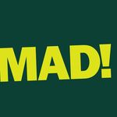

## About
Farm Flow is a system for team management and crop planning developed by Matthew
Fitzgerald and [Fitzgerald Organics](https://fitzgeraldorganics.net). Originally
designed as a physical whiteboard, the Farm Flow app is a digital adaptation of
the Farm Flow whiteboard system, built in collaboration with
[Runrig](https://runrig.org). The primary aim is to make bring the benefits of
this methodology to more farms and to put realtime data and visualizations at
the fingertips of every member of the team.

## Get Involved
If you're interested in using Farm Flow or have questions about its development,
feel free to open up a new topic in the [Runrig
Discussions](https://github.com/orgs/runrig-coop/discussions/) forum. You can
also view the [roadmap](https://github.com/orgs/runrig-coop/projects/3) and
[kanban](https://github.com/orgs/runrig-coop/projects/3/views/3) we're using for
collective project management. More documentation on how to use Farm Flow will
be forthcoming as we prepare to launch the first pilot. So stay tuned!

For now, a demo is available at https://farm-flow-board.pages.dev. You will need
to import a data file to get started, which can be downloaded as JSON from the
project's GitHub repository:
[`crop-2023.json`](https://github.com/runrig-coop/farm-flow-board/blob/main/public/crop-2023.json).
This demo should considered experimental and highly unstable; it will not be
provided with ongoing support.

See [CONTRIBUTING.md](CONTRIBUTING.md) for full instructions on how to setup the
local development environment.

## Supporters
Current maintainers:
- Jamie Gaehring, [Runrig](https://runrig.org)

This project has been sponsored by:
- Matthew Fitzgerald, [Fitzgerald Organics](https://fitzgeraldorganics.net)
- [Mad Agriculture](https://madagriculture.org/)

## License & Trademark
This work is licensed under a <a rel="license"
href="https://www.gnu.org/licenses">GNU Affero General Public License, Version 3 (AGPLv3)</a>.

Farm Flow is a registered trademark of [Matthew
Fitzgerald](https://fitzgeraldorganics.net).

